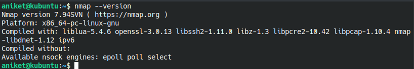
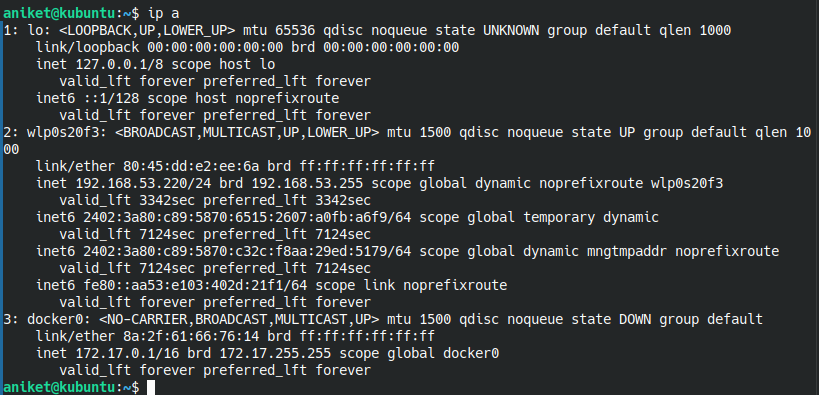
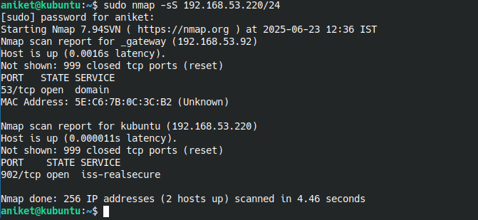
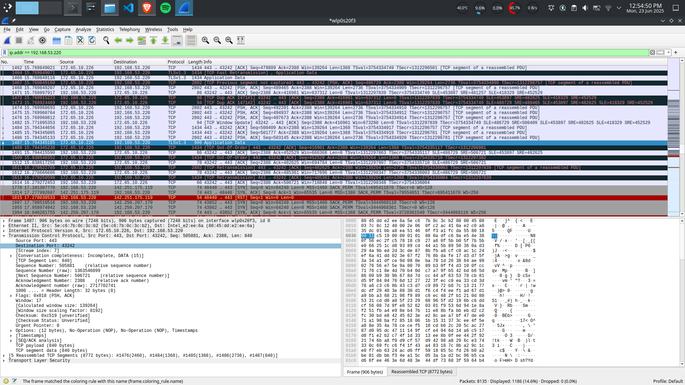
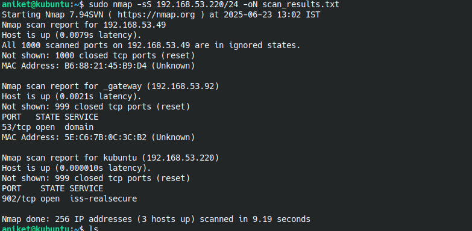
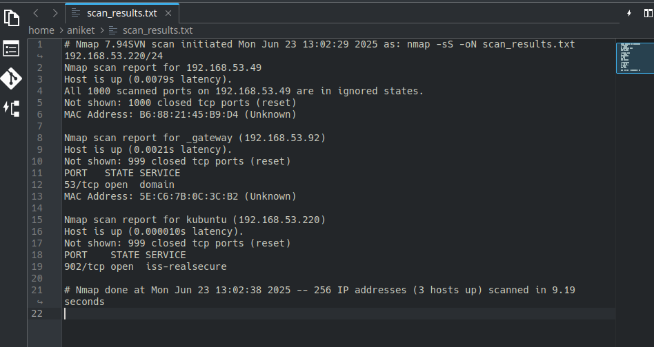
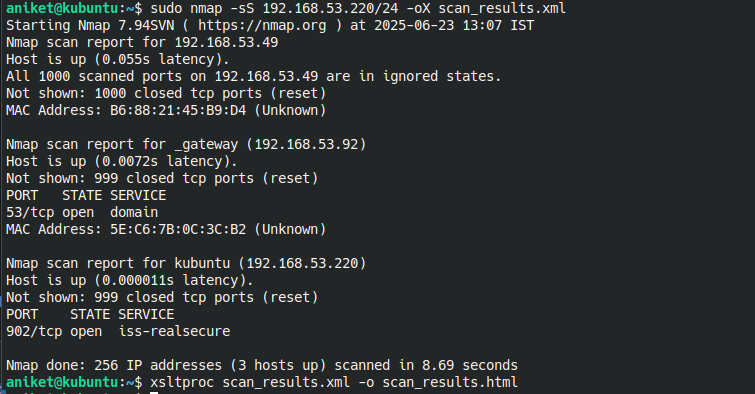

ELEVATE LABS - CYBER SECURITY INTERNSHIP

TASK 1: Scan Your Local Network for Open Ports

Objective: Learn to discover open ports on devices in your local network to understand network exposure. 
Tools: Nmap (free), Wireshark (optional)

Step 1: Install nmap (nmap is installed)

Step 2: Local IP address

IP address = 192.168.53.220

Step 3: Run: nmap -sS 192.168.53.220/24 to perform TCP SYN scan.

Open ports:
Port: 902/tcp
State: open
Service: iss-realsecure

Step 4: Analyze using Wireshark

Used filters like tcp.port == 80, tcp.port == 443, ip.addr == 192.168.53.220

Step 5: Identify security risks:

The port - 902 which is open in NMAP scan is not being used as per the Wireshark network scan.
Port 902 lets you manage a VMware virtualized environment.

Step 6: Save scan results

For text:
sudo nmap -sS 192.168.53.220/24 -oN scan_results.txt

For HTML:
sudo nmap -sS 192.168.53.220/24 -oX scan_results.xml
xsltproc scan_results.xml -o scan_results.html

